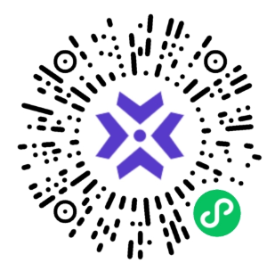
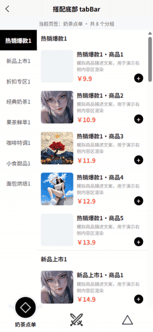
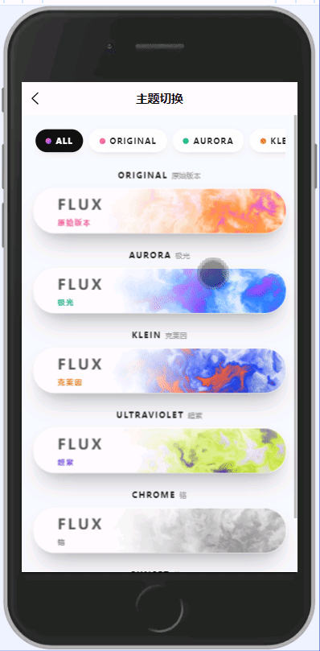
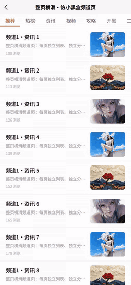
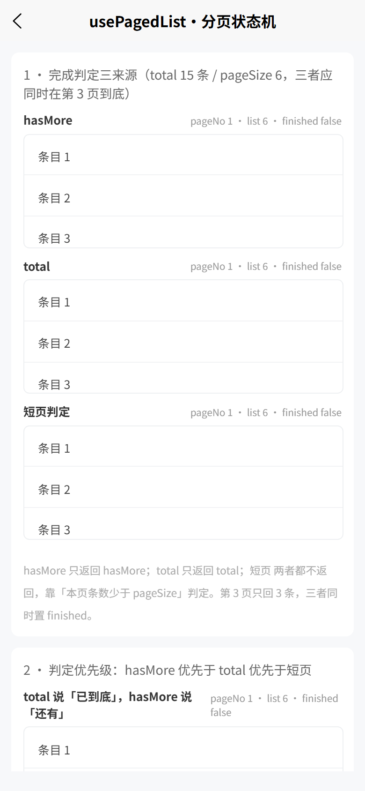
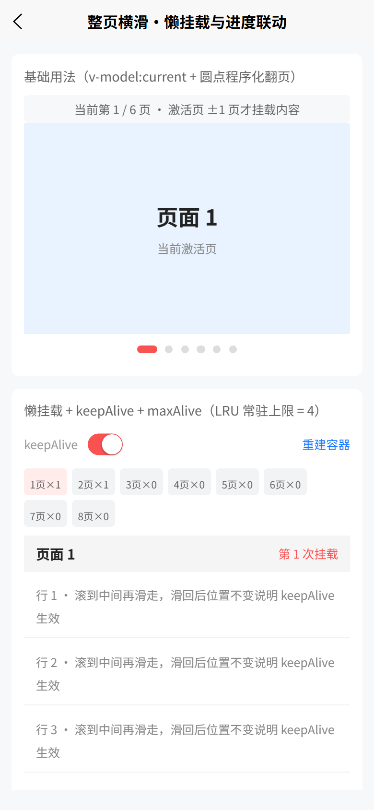
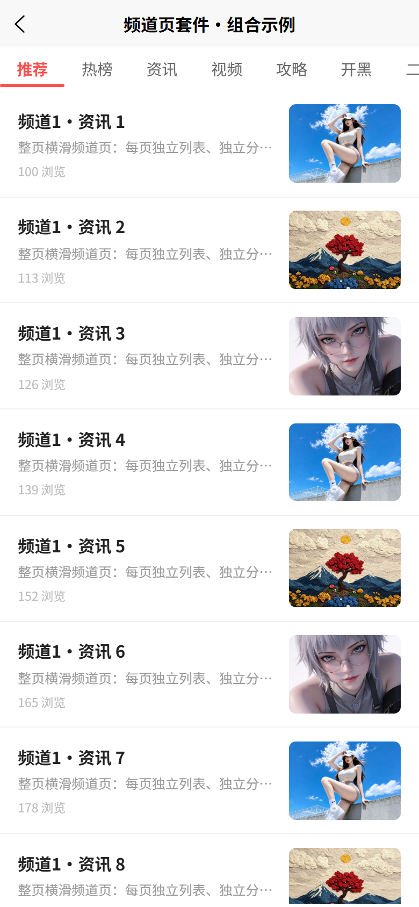

# shukelab

> uni-app Vue3 跨端组件库 —— 开箱即用的 uni_modules 组件集合

[](https://opensource.org/licenses/MIT)
[](https://uniapp.dcloud.net.cn/)

shukelab 是一套基于 **uni-app + Vue3 + TypeScript** 的跨端组件库，以 `uni_modules` 形式分发，零外部依赖，导入即用。支持 H5 与微信小程序双端。

---

## 特性

- **Vue3 + TypeScript** — 全量 Composition API + `<script setup>` 语法
- **跨端兼容** — H5 / 微信小程序双端适配，条件编译隔离平台差异
- **零依赖** — 组件无第三方运行时依赖，仅依赖 uni-app 框架
- **uni_modules 分发** — 拖入即用，无需 npm 配置
- **CSS 变量驱动** — 主题定制只需覆盖变量，无需修改源码

---

## 组件列表

| 组件            | 说明                                              | 插件地址                                                  |
| --------------- | ------------------------------------------------- | --------------------------------------------------------- |
| sk-linkage-menu | 左右联动菜单列表，支持吸顶/受控/异步加载/虚拟列表 | [DCloud 插件市场](https://ext.dcloud.net.cn/plugin?id=22894) |
| sk-tab-bar      | 凹陷弧形自定义 tabBar，支持角标/守卫/路由联动     | [DCloud 插件市场](https://ext.dcloud.net.cn/plugin?id=24578) |
| sk-camera       | H5 拍照相机组件，getUserMedia 前后置/裁剪         | `待发布`                                                |
| sk-flux-capsule | WebGL 流体色彩胶囊，扭曲 FBM 着色器               | `待发布`                                                |
| sk-swipe-feed  | 频道页三件套：sk-swipe-page 整页横滑（懒挂载/keepAlive/LRU）+ sk-scroll-tabs 滚动标签栏 + sk-scroll-list 滚动列表（内置下拉刷新头/footer 状态机），附 usePagedList | `待发布`                                                |

---

## 快速开始

### 方式一：插件市场导入（推荐）

1. 在 [DCloud 插件市场](https://ext.dcloud.net.cn/) 搜索组件名
2. 点击「导入插件」，选择目标项目
3. 组件自动安装到 `src/uni_modules/` 目录

### 方式二：手动复制

将 `src/uni_modules/sk-xxx` 目录整体复制到你的项目 `src/uni_modules/` 下即可。

### 使用示例

```vue
<template>
  <sk-flux-capsule
    :colors="['#ff4f9e', '#ff8c40', '#b83dff']"
    title="FLUX"
    :seed="1"
  />
</template>
```

uni_modules 组件无需手动注册，uni-app 编译器会自动识别 `components/` 目录下的同名组件。

---

## 预览

> 🔍 点击图片可在新窗口查看原图

<table>
  <tr>
    <td align="center">
      <a href="image/README/test2.png">
        
      </a>
      <br /><sub><b>微信小程序 · 扫码体验</b></sub>
    </td>
  </tr>
</table>

### sk-linkage-menu · 左右联动菜单

<table>
  <tr>
    <td width="50%" align="center" valign="top">
      <a href="https://github.com/user-attachments/assets/8fa94ecd-31c7-492e-8cc0-0a6b057f4611">
        
      </a>
      <br /><sub>左右联动 · 吸顶 / 虚拟列表</sub>
    </td>
    <td width="50%" align="center" valign="top">
      <a href="image/README/sk-linkage-menu-with-tabbar.gif">
        
      </a>
      <br /><sub>联动菜单 × sk-tab-bar 组合</sub>
    </td>
  </tr>
</table>

### sk-tab-bar · 凹陷弧形 tabBar

<table>
  <tr>
    <td width="50%" align="center" valign="top">
      <a href="https://github.com/user-attachments/assets/698e92dc-8edb-463c-8369-8a2c4227382f">
        
      </a>
      <br /><sub>凹陷弧形 · 切换动效</sub>
    </td>
    <td width="50%" align="center" valign="top">
      <a href="https://github.com/user-attachments/assets/29c96aa9-0df4-43dd-b190-9d6839546a5b">
        
      </a>
      <br /><sub>角标 / 主题定制</sub>
    </td>
  </tr>
</table>

### sk-flux-capsule · WebGL 流体胶囊

<table>
  <tr>
    <td width="100%" align="center" valign="top">
      <a href="image/README/1785820661385.gif">
        
      </a>
      <br /><sub>FBM 流体扭曲着色器</sub>
    </td>
  </tr>
</table>

### sk-swipe-feed · 整页横滑频道页三件套

<table>
  <tr>
    <td width="50%" align="center" valign="top">
      <a href="image/README/sk-swipe-page-demo.gif">
        
      </a>
      <br /><sub>组合演示 · 横滑切频道 / tab 联动 / 自定义刷新图标</sub>
    </td>
    <td width="50%" align="center" valign="top">
      <a href="image/README/sk-swipe-feed-paged-list.png">
        
      </a>
      <br /><sub>usePagedList 分页加载</sub>
    </td>
  </tr>
  <tr>
    <td width="50%" align="center" valign="top">
      <a href="image/README/sk-swipe-page-basic.png">
        
      </a>
      <br /><sub>sk-swipe-page · 懒挂载 / keepAlive / LRU</sub>
    </td>
    <td width="50%" align="center" valign="top">
      <a href="image/README/sk-swipe-page-tabs-linkage.png">
        
      </a>
      <br /><sub>sk-swipe-page × sk-scroll-tabs 联动</sub>
    </td>
  </tr>
</table>


---

## 平台兼容性

| 组件            | H5 | 微信小程序 | App |
| --------------- | :-: | :--------: | :-: |
| sk-linkage-menu | ✅ |     ✅     | — |
| sk-tab-bar      | ✅ |     ✅     | — |
| sk-camera       | ✅ |     ✅     | — |
| sk-flux-capsule | ✅ |     ✅     | — |
| sk-swipe-feed  | ✅ |     ✅     | — |

> ✅ 已验证 &nbsp; — 未测试/不适用

---

## 项目结构

```
src/
├── uni_modules/
│   ├── sk-flux-capsule/     # WebGL 流体色彩胶囊
│   ├── sk-linkage-menu/     # 左右联动菜单
│   ├── sk-tab-bar/          # 自定义 tabBar
│   ├── sk-camera/           # H5 拍照相机
│   └── sh-loading/          # 加载动画
├── pages/                   # 演示页面
└── pages.json               # 路由配置
```

---

## 开发

```bash
# 安装依赖
npm install

# H5 开发
npm run dev:h5

# 微信小程序开发
npm run dev:mp-weixin
```

---

## License

[MIT](https://opensource.org/licenses/MIT) © [KTBOY](https://github.com/KTBOY)
