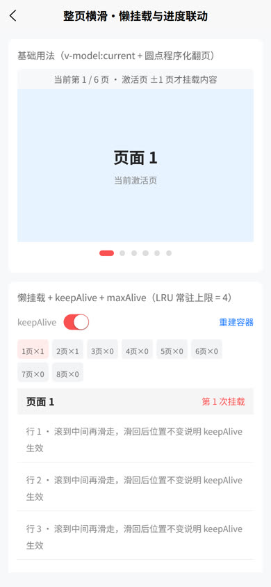
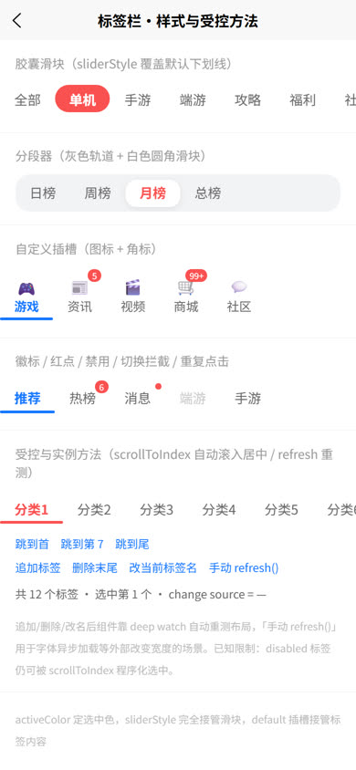
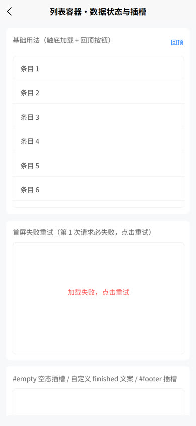
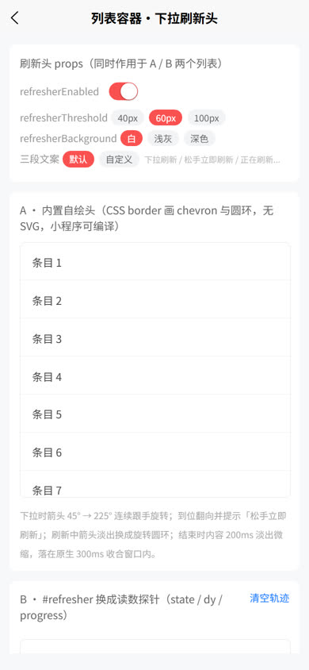
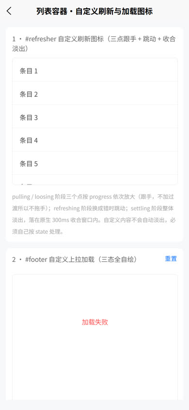
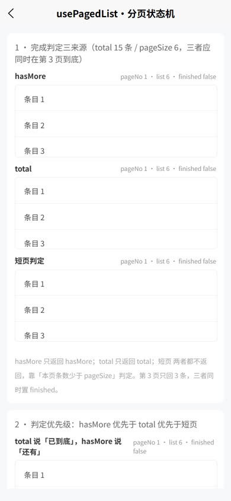

# sk-swipe-feed 整页横滑信息流三件套

资讯 / 社区类 App 频道页的完整方案，一个包装齐三个组件 + 一个分页状态机：

## 效果预览

**组合示例 + 自定义下拉刷新图标**（下拉刷新 → 收合 → 横滑切频道 → 点 tab 联动）


**整页横滑 · 懒挂载与进度联动**



**标签栏 · 样式与受控方法**



**列表容器 · 数据状态与插槽**



**列表容器 · 下拉刷新头**



**列表容器 · 自定义刷新与加载图标**



**usePagedList · 分页状态机**



| 成员 | 角色 | 一句话说明 |
| --- | --- | --- |
| `sk-swipe-page` | 整页横滑容器 | 基于原生 swiper 封装，页面级懒挂载 + keepAlive 保滚动位置 + LRU 常驻上限 + `transition` 实时进度 |
| `sk-scroll-tabs` | 顶部滚动标签栏 | 滑块动画、不等宽标签、徽标红点、切换拦截、选中项自动滚入居中 |
| `sk-scroll-list` | 滚动列表容器 | 内聚 scroll-view，内置下拉刷新头（CSS 绘制）、触底加载守卫、footer 状态机、空态错误态插槽 |
| `usePagedList` | 分页状态机 | 页码推进、防重入、完成判定、错误重试，组件只管滚动，数据流收敛于此 |

三个组件**零运行时耦合**：各自都能单独使用，也可以像下面这样拼成频道页。

## 组合使用：频道页（tabs + 整页横滑 + 信息流列表）

三个成员绑定同一个 `v-model:current` 即完成联动：点击 tab → 横滑容器翻页；滑动内容区 → tab 高亮跟随并自动滚入可视区；再次点击当前 tab → 该频道列表平滑回顶；每个频道页内是独立的下拉刷新 + 触底加载列表。

**页面 `channel-page.vue`：**

```vue
<template>
  <view class="page">
    <sk-scroll-tabs
      v-model:current="tabIndex"
      :tabs="channels"
      active-color="#fa5151"
      @re-click="onTabReClick"
    />
    <sk-swipe-page
      v-model:current="tabIndex"
      :count="channels.length"
      :max-alive="4"
      :height="contentHeight + 'px'"
    >
      <template #page="{ index, mounted }">
        <view v-if="mounted" style="height: 100%">
          <!-- 懒挂载：只有激活页 ±1 页内的频道才渲染列表 -->
          <channel-feed :ref="(el) => setFeedRef(index, el)" :fetch-page="fetchers[index]" />
        </view>
      </template>
    </sk-swipe-page>
  </view>
</template>

<script lang="ts" setup>
import { ref } from 'vue'
import type { SkScrollListExpose } from '@/uni_modules/sk-swipe-feed/components/sk-scroll-list/sk-scroll-list.types'
import type { PageFetcher } from '@/uni_modules/sk-swipe-feed/components/sk-scroll-list/use-paged-list'
import ChannelFeed from './channel-feed.vue'

const channels = ['推荐', '热榜', '资讯', '视频', '攻略']

/** 内容区高度 = 窗口高度 - 标签栏高度（按你的页面结构替换 44） */
const contentHeight = uni.getSystemInfoSync().windowHeight - 44

const tabIndex = ref(0)

/** 每个频道一个请求函数（此处替换为真实接口；page 从 1 开始） */
const fetchers: PageFetcher<{ id: number; title: string }>[] = channels.map((name) => {
  return async (page, pageSize) => {
    const res = await myApi.fetchList({ channel: name, page, pageSize })
    return { list: res.items, total: res.total }
  }
})

/** 各频道列表实例（用于 re-click 回顶） */
const feedRefs = new Map<number, SkScrollListExpose>()
const setFeedRef = (index: number, el: any) => {
  if (el) feedRefs.set(index, el as SkScrollListExpose)
  else feedRefs.delete(index)
}

/** 再次点击当前频道 tab：列表平滑回到顶部 */
const onTabReClick = (payload: { index: number }) => {
  feedRefs.get(payload.index)?.scrollToTop(true)
}
</script>

<style scoped>
.page {
  height: 100vh;
  overflow: hidden;
}
</style>
```

**列表 `channel-feed.vue`（每个频道页内部的分页列表）：**

```vue
<template>
  <sk-scroll-list
    :refreshing="feed.refreshing.value"
    :loading="feed.loading.value"
    :finished="feed.finished.value"
    :error="!!feed.error.value"
    :empty="feed.list.value.length === 0 && !feed.loading.value"
    height="100%"
    @refresh="feed.reload()"
    @load-more="feed.loadNext()"
    @retry="feed.loadNext()"
  >
    <view v-for="item in feed.list.value" :key="item.id" style="padding: 24rpx 32rpx">
      <text>{{ item.title }}</text>
    </view>
  </sk-scroll-list>
</template>

<script lang="ts" setup>
import type { PageFetcher } from '@/uni_modules/sk-swipe-feed/components/sk-scroll-list/use-paged-list'
import { usePagedList } from '@/uni_modules/sk-swipe-feed/components/sk-scroll-list/use-paged-list'

const props = defineProps<{ fetchPage: PageFetcher<{ id: number; title: string }> }>()

const feed = usePagedList(props.fetchPage, { pageSize: 10 })
</script>
```

## 安装

1. 在插件市场导入本 uni_module 到项目 `src/uni_modules/`（HBuilderX 导入会自动放入）。
2. 组件**无需手动 import**：uni_modules + easycom 默认自动扫描（匹配 `uni_modules/*/components/*/` 目录），模板里直接写 `<sk-swipe-page>` 等标签即可。
3. 类型按需导入：

```ts
import type { SkScrollListExpose, SkScrollListRefresherState } from '@/uni_modules/sk-swipe-feed/components/sk-scroll-list/sk-scroll-list.types'
import type { ChangePayload, TransitionPayload } from '@/uni_modules/sk-swipe-feed/components/sk-swipe-page/sk-swipe-page.types'
import type { SkScrollTabsItem, ChangePayload, ReClickPayload } from '@/uni_modules/sk-swipe-feed/components/sk-scroll-tabs/sk-scroll-tabs.types'
import { usePagedList } from '@/uni_modules/sk-swipe-feed/components/sk-scroll-list/use-paged-list'
```

4. **可运行示例**：完整 8 页演示（组合示例、自定义刷新图标、懒挂载可视化、分页状态机等）在源码仓库 [`src/pages/skSwipeFeedDemo/`](https://github.com/KTBOY/shukelab/tree/main/src/pages/skSwipeFeedDemo)，克隆后 `pnpm dev:h5` 逐页查看。

适配范围：**H5 与微信小程序**（Vue 3，HBuilderX 4.x 及以上；组件用到 `defineOptions` 等 Vue 3.3+ 宏，旧版编译器不支持）。

- **不支持 uni-app x**。uni-app x 使用 UTS 语言与 `.uvue` 文件、无 DOM/BOM、CSS 仅支持 flex 子集、`scroll-view` 用 `direction` 替代 `scroll-x/y`，本包需整体重写为 UTS 才能运行，**请勿在 uni-app x 项目中安装**。
- 其余平台（App-vue / nvue、其他小程序）未验证，见文末平台矩阵与已知限制。

---

## sk-swipe-page 整页横滑容器

### 基础用法

```vue
<template>
  <sk-swipe-page v-model:current="current" :count="3" height="60vh">
    <template #page="{ index, active, mounted }">
      <!-- 懒挂载：激活页 ± lazyBuffer 页内 mounted 才为 true -->
      <view v-if="mounted" class="page">
        <text>{{ index + 1 }}{{ active ? '（激活）' : '' }}</text>
      </view>
    </template>
  </sk-swipe-page>
</template>

<script lang="ts" setup>
import { ref } from 'vue'
const current = ref(0)
</script>
```

### Props

| 属性名 | 类型 | 默认值 | 说明 |
| --- | --- | --- | --- |
| count | Number | 0 | 页面总数 |
| current | Number | 0 | 当前页下标，支持 `v-model:current` |
| lazyBuffer | Number | 1 | 懒挂载缓冲：激活页左右各 n 页内的页面才挂载内容 |
| keepAlive | Boolean | true | 已挂载页面是否常驻；false 时滑出缓冲区的页面被卸载（滚动位置丢失） |
| maxAlive | Number | 0 | 常驻页数上限（LRU 淘汰最久未访问的窗口外页面，常用频道优先保留），0 表示不限制 |
| duration | Number | 300 | 翻页动画时长（ms） |
| height | String | '100%' | 容器高度 |
| autoplay | Boolean | false | 自动轮播（透传 swiper） |
| interval | Number | 5000 | 自动轮播间隔（ms） |
| circular | Boolean | false | 循环播放（透传 swiper；开启后挂载窗口按下标回绕补挂，避免克隆页闪白） |

### Events

| 事件名 | 说明 | 回调参数 |
| --- | --- | --- |
| change | 页面切换时触发（滑动、外部受控均会触发） | `{ index, source }`，source 为 `swipe`（用户滑动）/ `method`（外部受控） |
| update:current | 页面下标变化，配合 `v-model:current` 使用 | `index: number` |
| transition | 翻页手势/动画进行中实时触发（标题栏渐变、视差联动） | `{ dx, dy, progress }`，progress = dx / 容器宽度 |

### Slots

| 插槽名 | 说明 | 作用域参数 |
| --- | --- | --- |
| page | 每页内容渲染一次，配合 `v-if="mounted"` 实现懒挂载 | `{ index, active, mounted }` |

### 性能说明

1. **懒挂载**：未激活的页面不渲染任何内容，节点数只与「激活页 ± lazyBuffer」相关；越远的页面滑动成本越低。
2. **常驻保滚动**：keepAlive 开启时挂载过的页面不销毁，滑回时滚动位置保留（信息流体验的关键）。
3. **LRU 上限**：maxAlive 限制常驻页数，频道很多时防止内存无限增长；淘汰按最近访问顺序，激活页与常用频道排在队尾最后收回。
4. **页面自治**：每页内容（含其列表的分页/虚拟化）由 page 插槽自治，容器不感知业务。

---

## sk-scroll-tabs 顶部滚动标签栏

### 基础用法

```vue
<template>
  <sk-scroll-tabs v-model:current="current" :tabs="tabs" active-color="#fa5151">
    <template #default="{ item, active }">
      <text>{{ item.name }}</text>
    </template>
  </sk-scroll-tabs>
</template>

<script lang="ts" setup>
import { ref } from 'vue'
const tabs = ref([
  { id: 1, name: '今日推荐' },
  { id: 2, name: '热销爆款' },
])
const current = ref(0)
</script>
```

### Props

| 属性名 | 类型 | 默认值 | 说明 |
| --- | --- | --- | --- |
| tabs | SkScrollTabsItem[] | [] | 标签数据，结构见下方 SkScrollTabsItem |
| current | Number | 0 | 当前选中标签下标，支持 `v-model:current` |
| activeColor | String | '#111111' | 选中态文字颜色，同时作为滑块默认背景色 |
| sliderStyle | Object | - | 选中滑块样式（覆盖默认下划线样式） |
| scrollWithAnimation | Boolean | true | 程序化滚动是否使用动画 |
| beforeChange | Function | - | 切换拦截：(index) => boolean \| Promise<boolean>，返回 false 阻止本次点击切换 |

### Events

| 事件名 | 说明 | 回调参数 |
| --- | --- | --- |
| change | 选中标签变化时触发（点击、外部受控均会触发） | `{ ...tab, index, source }`，source 为 `click`（点击标签）/ `method`（外部受控） |
| update:current | 选中下标变化，配合 `v-model:current` 使用 | `index: number` |
| re-click | 再次点击当前已选中的标签（如列表回顶） | `{ index, item }` |

### Slots

| 插槽名 | 说明 | 作用域参数 |
| --- | --- | --- |
| default | 标签内容，每个标签渲染一次 | `{ item, index, active }` |

### Methods（通过 ref 调用）

| 方法名 | 说明 | 参数 |
| --- | --- | --- |
| scrollToIndex | 切换到指定标签（更新高亮并把该标签滚入可视区居中） | `index: number` |
| refresh | 重新测量标签布局。tabs 数据替换后组件会自动调用，字体加载等场景可手动触发 | - |

**SkScrollTabsItem 类型**

| 属性名 | 类型 | 必填 | 说明 |
| --- | --- | --- | --- |
| name | String | 建议 | 标签名称，用于默认渲染 |
| id | Number/String | 建议 | 唯一标识，优先作为渲染 key |
| badge | Number | 否 | 数字角标（默认插槽渲染，>99 显示 99+） |
| dot | Boolean | 否 | 红点（badge 同时设置时 badge 优先） |
| disabled | Boolean | 否 | 禁用：不响应点击、置灰 |
| （自定义字段） | any | 否 | 随 change 事件透出，可用于分组联动反查 |

---

## sk-scroll-list 滚动列表容器

### 基础用法

```vue
<template>
  <sk-scroll-list
    :refreshing="feed.refreshing.value"
    :loading="feed.loading.value"
    :finished="feed.finished.value"
    :error="!!feed.error.value"
    :empty="feed.list.value.length === 0 && !feed.loading.value"
    height="300px"
    @refresh="feed.reload()"
    @load-more="feed.loadNext()"
    @retry="feed.loadNext()"
  >
    <view v-for="item in feed.list.value" :key="item.id">{{ item.title }}</view>
  </sk-scroll-list>
</template>
```

组件不持有数据：`refreshing / loading / finished / error` 全部受控传入，推荐配合本包的 `usePagedList`（见下节）。刷新期间旧内容保留，数据原地替换，列表不清空。

### 内置下拉刷新头

默认自绘刷新头，全部用 CSS border 实现（无 SVG、无字体字形依赖，小程序可编译）：

- **跟手**：下拉过程中 chevron 箭头按进度连续旋转（45° → 225°），`pulling` 阶段无过渡不拖手。
- **到位提示**：进度达到 `refresherThreshold * 0.9` 时切入「松手立即刷新」，略低于原生触发点，保证松手前可见。
- **刷新中**：箭头淡出，切换为旋转圆环。
- **收合（settling）**：刷新结束时内容以 200ms 淡出 + 微缩，落在 uni 原生 refresher 的 300ms 高度收合窗口内，避免「内容先消失、空盒再缩」的两段式跳变；圆环保持旋转只降透明度，不骤停。
- 刷新头容器高度 = `refresherThreshold`（px），默认 60，同时绑定给原生 `refresher-threshold`。
- 居中：容器显式 `width: 100%` + flex 居中，不依赖各端原生容器的 stretch 行为。

传入 `#refresher` 插槽可整体替换（作用域 `{ state, dy, progress }`，state 为 `idle / pulling / loosing / refreshing / settling`）：

```vue
<sk-scroll-list refresher-background="#2b2b33" ...>
  <template #refresher="{ state, progress }">
    <view style="height: 100%; display: flex; align-items: center; justify-content: center">
      <text style="color: #fff">{{ state }} · {{ Math.round(progress * 100) }}%</text>
    </view>
  </template>
</sk-scroll-list>
```

settling 时自绘内容不会自动淡出，需要自行按 state 做透明度过渡（内置头已处理）。

### 自定义上拉加载（`#footer`）

传入 `#footer` 插槽即**整体替换**内置 footer 状态机（作用域 `{ loading, finished, error, refreshing }`）。两个必须注意的点：

1. `error` / `loading` / `finished` **三个分支都要自己渲染**，漏掉任何一个都会出现「正在加载但底部什么都没有」。
2. 内置文案 props（`loadingText` / `finishedText` / `errorText`）随之全部失效，文案要自己写；失败态也要自己绑点击重试。

```vue
<sk-scroll-list ... @retry="feed.loadNext()">
  <template #footer="{ loading, finished, error }">
    <text v-if="error" style="color: #fa5151" @click="feed.loadNext()">加载失败，点击重试</text>
    <view v-else-if="loading"><text>正在加载</text></view>
    <text v-else-if="finished">— 到底啦 —</text>
  </template>
</sk-scroll-list>
```

`#empty`（空态）与 `#error`（首屏失败且无数据）同理整体替换内置视觉，无作用域参数；`#error` 内也要自己绑点击重试。

### 自定义图片刷新图标

把自己的品牌 logo 作为刷新指示器，是 `#refresher` 最常见的用法。三个关键约束，踩一个就会「看起来不对」：

1. **跟手阶段用内联 transform 旋转，且不加 transition**——加了会拖手。
2. **`refreshing` / `settling` 交给 CSS 动画**：动画优先级高于内联 transform，这两个状态下不要再写内联旋转，否则互相打架。
3. **`settling` 要自己淡出**：内置头会做，自定义内容不会，不处理就是「内容先消失、空盒再缩」的两段式跳变。

```vue
<sk-scroll-list ...>
  <template #refresher="{ state, progress }">
    <view class="my-refresher" :class="{ 'my-refresher--out': state === 'settling' }">
      <image
        class="my-refresher__icon"
        :class="{ 'my-refresher__icon--spin': state === 'refreshing' || state === 'settling' }"
        :style="iconStyle(state, progress)"
        src="/static/your-logo.png"
        mode="aspectFit"
      ></image>
      <text class="my-refresher__text">{{ refresherText(state) }}</text>
    </view>
  </template>
</sk-scroll-list>
```

```js
const iconStyle = (state, progress) => {
  if (state === 'refreshing' || state === 'settling') return {} // 旋转交给 CSS 动画
  const p = Math.min(Math.max(progress, 0), 1)
  return { transform: `rotate(${Math.round(p * 360)}deg)`, opacity: (0.35 + p * 0.65).toFixed(3) }
}
```

```css
.my-refresher { height: 100%; display: flex; flex-direction: column; align-items: center; justify-content: center; transition: opacity 0.2s ease-out; }
.my-refresher--out { opacity: 0; }
.my-refresher__icon { width: 56rpx; height: 56rpx; }
.my-refresher__icon--spin { animation: my-spin 0.9s linear infinite; }
@keyframes my-spin { from { transform: rotate(0deg); } to { transform: rotate(360deg); } }
```

完整可运行版本见示例仓库 `src/pages/skSwipeFeedDemo/components/channel-feed-icon.vue`（图标路径是 prop，直接换图即可）。

### 首屏加载与空态

加载反馈必须与触发源匹配，否则用户会误读。组件按以下规则自动分派：

| 状态 | 条件 | 默认视觉 | 可替换插槽 |
| --- | --- | --- | --- |
| 首屏加载 | `empty && loading` | 居中 loading + loadingText | `#loading`（自定义 loading 视觉） |
| 首屏失败 | `empty && error` | 居中错误文案，点击重试 | `#error` |
| 空态 | `empty` 且非 loading | 居中 emptyText | `#empty` |
| 加载更多 | `loading` 且已有数据 | 底部 spinner + loadingText | `#footer` |
| 到底 | `finished` | 底部分割线 + finishedText | `#footer` |
| 下拉刷新 | `refreshing` | 顶部内置刷新头 | `#refresher` |

`empty` 直接传 `list.length === 0` 即可，**不要**自己写成 `list.length === 0 && !loading`——那样首屏加载会落进「加载更多」分支：列表还没有任何数据时，spinner 会贴在空白内容区顶部，看起来和下拉刷新一模一样。

默认就是居中 loading + `loadingText`，多数场景无需传插槽。需要品牌化时整体替换：

```vue
<sk-scroll-list :empty="list.length === 0" :loading="loading" ...>
  <template #loading>
    <my-loading />
  </template>
</sk-scroll-list>
```

### Props

| 属性名 | 类型 | 默认值 | 说明 |
| --- | --- | --- | --- |
| refreshing | Boolean | false | 刷新中状态（受控）：下拉刷新请求进行中为 true，结束后置 false |
| loading | Boolean | false | 加载更多请求进行中 |
| finished | Boolean | false | 是否已全部加载（无更多数据） |
| error | Boolean | false | 最近一次加载是否失败（footer 展示重试，点击外发 retry） |
| empty | Boolean | false | 列表是否没有任何数据。直接传 `list.length === 0` 即可，无需自行排除加载中：组件以 `empty && loading` 展示首屏加载态，`empty` 且非 loading 才展示空态 |
| height | String | '100%' | 容器高度 |
| emptyText | String | '暂无数据' | 空态提示文案 |
| loadingText | String | '加载中...' | 加载更多提示文案 |
| finishedText | String | '没有更多了' | 全部加载完提示文案 |
| errorText | String | '加载失败，点击重试' | 加载失败提示文案（点击重试） |
| refresherEnabled | Boolean | true | 是否开启下拉刷新（纯展示列表可关闭） |
| refresherThreshold | Number | 60 | 触发自建下拉头的下拉距离（px），同时作为原生 refresher-threshold 与下拉头容器高度 |
| pullingText | String | '下拉刷新' | 下拉中提示文案 |
| loosingText | String | '松手立即刷新' | 下拉到位、松手即刷新的提示文案 |
| refreshingText | String | '正在刷新...' | 刷新中提示文案 |
| customStyle | Object | {} | 自定义样式（合并到容器；其中的 height 会覆盖 height 属性） |
| refresherBackground | String | '#fff' | 下拉刷新区域背景色 |
| lowerThreshold | Number | 50 | 触底阈值（px） |

### Events

| 事件名 | 说明 | 回调参数 |
| --- | --- | --- |
| refresh | 下拉刷新触发（列表须在顶部，原生 refresher 保证） | - |
| load-more | 滚动触底（loading / finished / refreshing 中组件自行拦截不外发） | - |
| retry | footer 失败重试点击 | - |

### Slots

| 插槽名 | 说明 | 作用域参数 |
| --- | --- | --- |
| default | 业务列表项 | - |
| loading | 首屏加载态（列表尚无任何数据时），整体替换内置居中 loading | - |
| refresher | 自定义下拉头，整体替换内置视觉 | `{ state, dy, progress }`，state 为 idle / pulling / loosing / refreshing / settling |
| footer | 自定义底部状态，整体替换内置状态机 | `{ loading, finished, error, refreshing }` |
| empty | 空态 | - |
| error | 首屏失败且无数据的错误态 | - |

### Methods（通过 ref 调用）

| 方法名 | 说明 | 参数 |
| --- | --- | --- |
| scrollToTop | 列表回到顶部（配合「再次点击当前 tab 回顶」等场景）；H5 端 smooth 为 true 时 300ms 平滑滚动，小程序端走 scroll-top 动画 | `smooth?: boolean` |

---

## usePagedList 分页状态机

职责分层：组件只管滚动与手势，分页数据流（页码推进、防重入、完成判定、错误重试）收敛在此 composable，横滑频道页与纵向列表均可复用。

```ts
import { usePagedList } from '@/uni_modules/sk-swipe-feed/components/sk-scroll-list/use-paged-list'

// fetchPage(page, pageSize) => Promise<{ list, total?, hasMore? }>
const feed = usePagedList(fetchPage, { pageSize: 10 })
// 触底时 feed.loadNext()，下拉刷新时 feed.reload()，切换筛选条件时 feed.reset()
```

**返回值**

| 字段 | 类型 | 说明 |
| --- | --- | --- |
| list | ShallowRef&lt;T[]&gt; | 已加载的全部数据 |
| pageNo | Ref&lt;number&gt; | 已加载的页数 |
| loading | Ref&lt;boolean&gt; | 是否正在加载更多 |
| refreshing | Ref&lt;boolean&gt; | 下拉刷新请求进行中（供 refreshing prop 绑定） |
| finished | Ref&lt;boolean&gt; | 是否已全部加载 |
| error | Ref&lt;unknown&gt; | 最近一次加载的错误，成功后自动清空 |
| loadNext | (count?) => Promise | 加载下一页（防重入；loading / finished / refreshing 期间忽略） |
| reset | () => void | 清空数据回到第一页（不自动发起请求） |
| reload | () => Promise | 刷新：原地重载第一页，期间保留旧内容，成功后整体替换 |

**规则**：完成判定优先级 `hasMore > total > 短页`；请求失败时 pageNo 不推进、error 置为异常，再次 loadNext 即重试；loadNext 与 reload 通过请求序号互斥，刷新开始后在途的加载更多结果会被丢弃。

---

## 平台差异

- **scrollToTop**：H5 端用 rAF 直接驱动真实滚动层（依赖 uni 内部 DOM 结构，见已知限制）；小程序端走 `scroll-top` 绑定 + `scroll-with-animation`。
- **transition.progress**：依赖组件挂载时的容器宽度测量（`SelectorQuery`）；测量未就绪时会补测一次，窗口 resize 时自动重测。测量失败时 progress 恒为 0。
- **下拉收合动画**：settling 的 200ms 淡出是对齐 uni H5 原生 refresher 的 300ms 高度收合；微信小程序端 refresher 由原生层渲染，建议在开发者工具中人工确认一次收合手感。
- **窗口 resize 重测**：sk-swipe-page 与 sk-scroll-tabs 监听 `uni.onWindowResize` 自动重测。
- **sk-scroll-tabs 首测补测**：小程序端首帧布局可能未就绪，`boundingClientRect` 拿不到尺寸会导致选中滑块不渲染；组件在挂载后 150ms 有界补测一次（不轮询）。字体异步加载使标签变宽的场景仍建议手动调 `refresh()`。

## 已知限制

**sk-scroll-list**

- `scrollToTop(true)` 的 300ms 动画期间用户滚动会被覆盖（未做手势中断）。
- `customStyle.height` 会覆盖 `height` 属性（数组样式后者优先）。
- H5 端平滑回顶依赖 uni 内部 DOM 结构（`.uni-scroll-view-scrollbar-hidden`），uni 大版本升级可能需要适配；解析失败时自动退化为 `scroll-top` 路径。
- 刷新头容器高度等于 `refresherThreshold`，插槽内容超出会被原生 `overflow:hidden` 裁切。
- 无虚拟列表 / 骨架屏 / 内置回顶按钮（数据量大时请在 page/default 插槽内自行处理）。

**sk-swipe-page**

- `transition` 事件每帧外发且未节流，标题栏渐变等用法会导致父组件每帧重渲染（小程序端为每帧 setData），请保持联动组件轻量。
- `progress` 依赖宽度测量成功，测量失败时为 0。
- `autoplay` 触发的翻页 `change.source` 报为 `'swipe'`（无 `'autoplay'` 枚举）。
- `circular` 下 swiper 克隆首尾页，克隆页参与懒挂载回绕窗口；开启 circular 会额外常驻克隆内容。
- `keepAlive` / `maxAlive` / `lazyBuffer` 运行时改动不会立即重算挂载窗口（组件只监听 `current` 与 `count`），需等下一次翻页才生效；要立刻生效可给容器换 `key` 强制重建。
- 每次翻页触发 O(count) 次 page 插槽重调用，频道数很大时需注意。

**sk-scroll-tabs**

- 标签宽度变化（含字体异步加载、原地改 item 字段）依赖 deep watch 自动重测，也可手动调 `refresh()`。
- 超宽标签（宽于视口）居中显示中段。
- `disabled` 标签仍可被 `scrollToIndex` / 外部 `current` 程序化选中。
- 越界 `current` 只发 `update:current` 不发 `change`，滑块退化为不可见。

## 常见问题

**列表不滚动 / 页面内容被裁掉？**
不少模板把 `page` 设成 `overflow: hidden`（全屏布局的常见做法），页面就没有原生滚动。`sk-scroll-list` 自带 `scroll-view`，不受影响；但**页面级**的长内容（多个演示块、长表单等）需要你自己套一层 `<scroll-view scroll-y>` 作为根节点并给确定高度。

**页面里嵌了多个 `sk-scroll-list`，拖列表时整页不滚？**
小程序端同方向的嵌套 `scroll-view` 没有滚动链：手指在列表上只滚那个列表，列表到边界后不会带动外层。要滚整页请拖列表以外的区域。

**监听 `@transition` 做联动后页面卡顿？**
`transition` 每帧外发且未节流，小程序端即每帧 `setData`。联动组件保持轻量（只改 style，不触发大列表重渲染）；不需要进度联动时不要监听该事件。

**为什么我的下拉刷新图标不转 / 一闪而过？**
见上文「自定义图片刷新图标」的三条约束：跟手阶段别加 transition、`refreshing` 交给 CSS 动画、`settling` 自己淡出。

## 更新日志

见 [changelog.md](./changelog.md)。
